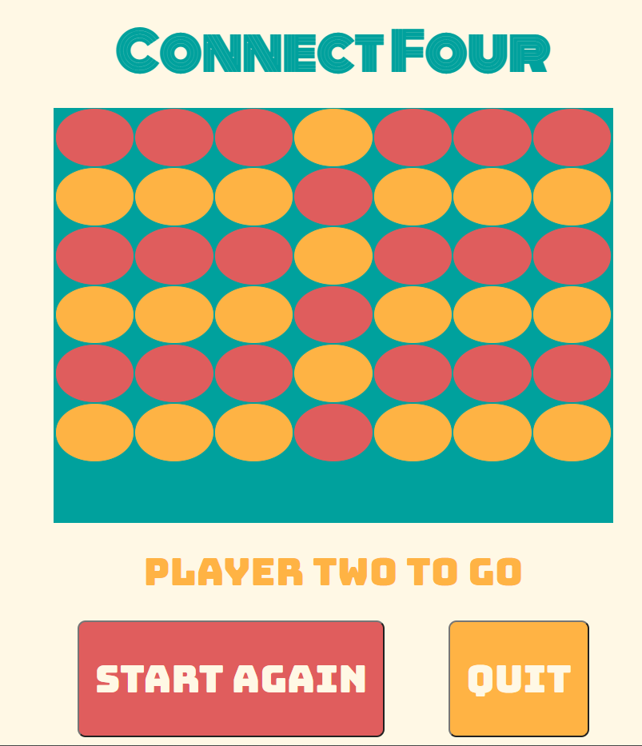

# Feedback

## Goals

1. A working Game - done

   - 110% It is sick, so many challenging features you have added and have got them to work in the game.
   - Vertical, Horizontal and Diagonal

2. Practice using Git & Github-flow - done

   - 110% 4 Branches, 58 commits

3. Apply what you are learning - done

   - SCSS, BEM , Classes etc.... So much good stuff

## Specification

- PSEUDOCODE - done

  - I can see your though process in the how it should work section of your readme.md. Good problem solving / breakdown.

  - Github repo & README.MD - done

  - Repo has been set up perfect
  - Readme is great, I would suggest adding a couple of things.
    - How do you clone it and set it up?
    - the link to the live site?

- 25 Commits - done

- Use click or key press event in JS - done

- Mobile first/Responsive - done

- No tutorials - done

- Link to the project on your portfolio - not sure.

## Overall

This is a great game, lots of difficult things to check consider in breaking the game down. You have used a Class which is awesome and for the game it makes sense. You have a game object which has all of the functionality inside it.

The animations / styles are great. You can see that you have taken everything we have learned so far and put it into this project. Well everything but testing :P.

## To work on

There isn't much more to do, in my opinion these should be things to focus on if you have the time.

### House keeping

- remove commented out code
- remove console.log()

### Draw functionality?

At the moment if you draw nothing happens, you have covered yourself with the quit button.

It would be a interesting piece of functionality to try and add to the project.



- Do you check the board?
- When a certain number of reached and someone hasn't won it must be a draw? A counter?

### Nested control flow / Readability

I think you should try and simplify some of your logic. Sometimes you have to nest if statements but you should try and avoid this as it becomes more and more unreadable the more you next if statements.

I have simplified the code below.

Your code;

```js
// 67 - 115
playerTurn() {

    for ( let i = 0; i < this.cellsArray.length; i++) {
      this.cellsArray[i].addEventListener("click", (event) => {
        event.preventDefault();


        if (!this.cellsArray[i + 7].classList.contains('taken')) {
          return;
        }

        else {

          if (this.isPlayerOnesTurn )  {
            if (this.cellsArray[i].classList.contains('taken')) {
              return;
            }
            else {
              this.cellsArray[i].classList.remove("game__area--cell")
              this.cellsArray[i].classList.add("game__area--playerone")
              this.cellsArray[i].classList.add("taken")
              console.log(this.cellsArray[i])
              this.isPlayerOnesTurn = false;
              this.isPlayerTwosTurn = true;
              gamePlayer.innerHTML = "Player Two"
              gamePlayerText.classList.add("game__current-player2")
            }
          }

          else {
            if (this.isPlayerTwosTurn )  {
              if (this.cellsArray[i].classList.contains('taken')) {
                return;
              }
            else {
              this.cellsArray[i].classList.remove("game__area--cell")
              this.cellsArray[i].classList.add("game__area--playertwo")
              this.cellsArray[i].classList.add("taken")
                this.isPlayerOnesTurn = true;
                this.isPlayerTwosTurn = false;
                gamePlayer.innerHTML = "Player One"
                gamePlayerText.classList.remove("game__current-player2")
            }}
          }
        this.checkWin();
        this.checkDraw();
      }})
    }
  }

```

Could be

```js
 playerTurn() {
    for (let i = 0; i < this.cellsArray.length; i++) {
      this.cellsArray[i].addEventListener("click", event => {
        event.preventDefault();
        // this.cellsArray[i].classList.contains("taken") has been added to the check below
        // it was repeated in the code above
        if (!this.cellsArray[i + 7].classList.contains("taken") && this.cellsArray[i].classList.contains("taken")) {
          return;
        }
        // if it is playerOnes turn the else will now be playerTwo's turn
        if (this.isPlayerOnesTurn) {
          this.cellsArray[i].classList.remove("game__area--cell");
          this.cellsArray[i].classList.add("game__area--playerone");
          this.cellsArray[i].classList.add("taken");
          console.log(this.cellsArray[i]);
          this.isPlayerOnesTurn = false;
          this.isPlayerTwosTurn = true;
          gamePlayer.innerHTML = "Player Two";
          gamePlayerText.classList.add("game__current-player2");
        } else {
          this.cellsArray[i].classList.remove("game__area--cell");
          this.cellsArray[i].classList.add("game__area--playertwo");
          this.cellsArray[i].classList.add("taken");
          this.isPlayerOnesTurn = true;
          this.isPlayerTwosTurn = false;
          gamePlayer.innerHTML = "Player One";
          gamePlayerText.classList.remove("game__current-player2");
        }

        this.checkWin();
        this.checkDraw();
      });
    }
 }
```

It is very minor but it is something to consider for readability. Let me know if you want me to explain any of the points from the file.

---
